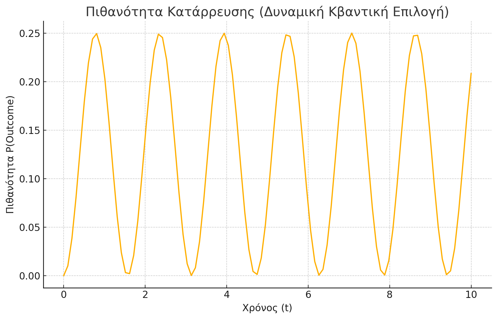

# Theory of the Causal Origin and Self-Referentiality of the Universe

Description

This project presents a theoretical exploration of the Causal Origin and the Self-Referentiality of the Universe. According to the proposed theory, the universe is caused by an unknown external source, a source that possessed all the information from the very beginning and transmitted it to the universe. Since then, the universe has evolved to be self-referential and selective, following the principles of quantum choice.

The work investigates how causality, which originates from an external source, continues within the universe through self-referential loops and how quantum mechanics and the collapse of the wave function contribute to the selective nature of reality.
Key Points of the Theory:

    The universe's origin is external and unknown, and it contains all information from the start.
    The universe became self-referential after this transmission of information.
    The universe operates based on quantum choice, meaning the decisions of the system are shaped by quantum mechanics and quantum observation.

Language

The full content of this research and analysis is written in Greek. Though the title and abstract are in English, the main body of the work is in Greek.
